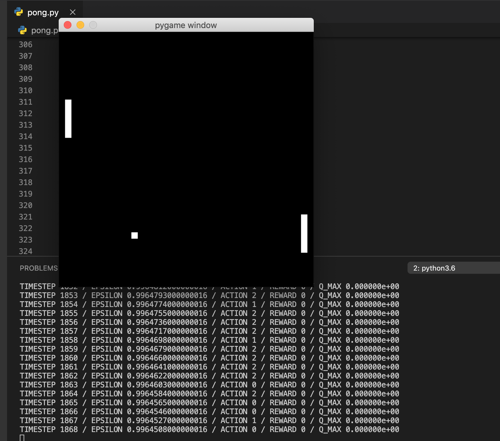

# Pong game with neural network:

This was my first project using tensorflow. I used this to play around with some ideas I have been having for a final project at Makers. 

I have been fascinated at the idea of machine learning, and my continued learning into the field of linear algebra and neural networks brought me to tensorflow.

As a ‘dry run’ i used the following tutorial (https://www.youtube.com/watch?v=Hqf__FlRlzg&t=1309s)to help build the game, and then set about modifying the tensor flow code to make it work.

The right paddle on the screen is linked to the neural network, and will therefore learn as time goes on and it is trained more. The left paddle on the screen has random up/down inputs.

__How to run the program:__

(Assuming that the user has a Python version between 3.4 - 3.7)

First check that pip is installed to the latest version, in the command line type: 

```
pip install --upgrade pip
```

Then install tensorflow:

```
pip install tensorflow
```

Then install opencv:

```
pip install opencv
```

Then install pygame:

```
pip install pygame
```

Then by typing the following in the command line, we can run the game and watch the neural network train on the pong game:

```
python RL.py
```

---
## AI in Action

